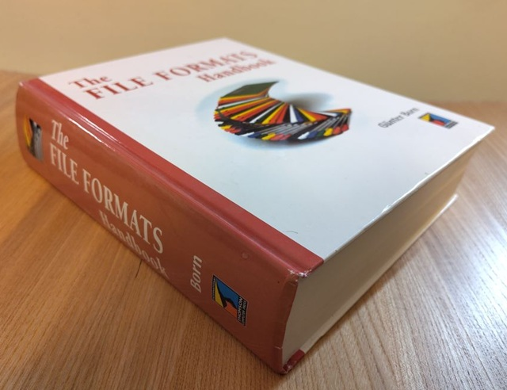

TFFH: File extensions from The File Formats Handbook (Günter Born)
==================================================================

[The File Formats Handbook by Günter Born](https://openlibrary.org/works/OL8407869W/The_File_Formats_Handbook?edition=key%3A/books/OL9805911M#overview) was published in 1995, and documents 84 distinct format/format families from popular software of the time. Most of the formats are described in great detail, sufficient to parse the data out of those formats and so more than enough to help design binary format signatures.

One evening, I skimmed through the book to try and list all the file formats and extensions in the book, so the contents could be compared to and integrated with the other format information sources.  The book is not very consistent in how it declares which file extensions are used by each format. Sometimes it appears to be declared in the chapter title, sometimes it is assumed and not really explicitly stated, sometimes declared in a table, sometimes it is buried in the body text, and some are only listed in Appendix A. As such, there may be some mistakes in this data.

The data was mastered in [TFFH: File extensions from The File Formats Handbook (Günter Born) - Google Sheets](https://docs.google.com/spreadsheets/d/1Zudz1pZyOsEzfdGTbk3S4YqLJLCl2CyHn4E5ss2oqbQ/edit?gid=0#gid=0) (please add comments if you spot errors!)

That was downloaded in CSV format and added here as `tffh.csv`.

## Book Back Cover Text

The File Formats Handbook by Günter Born

"An indispensable resource for programmers, consultants, researchers, and students in the field of graphics and file formats"

Today, each applications program uses its own vendor-specific format to store data. Yet end-users demand that programs accept data files that may have been created by totally different and sometimes competing programs. Software developers in particular depend on the file format information of different applications programs to implement advanced import and export functions. Unfortunately, most of the information about file formats is confidential, not well-documented, or not available for public use.

The painful search for file format information is now over. The File Formats Handbook uncovers the file formats used by popular software products in the areas of databases, spreadsheets, word processing, graphics, sound and multimedia. It is unmatched by any other book in its depth and breadth of coverage and in its attention to detail.

Included are:

- Database and index files for dBASE and FoxPro
- Spreadsheet file formats for Lotus 1-2-3, Excel, DIF, SIF, SYLK
- Word processing file formats for WORD, WordPerfect, WordStar, AMI Pro, SGML, and Rich Text Format (RTF)

Graphics file formats: PCX, GEM, IMG, Computer Graphics Metafile (CGM), WordPerfect Graphics (WPG), Windows and OS/2 BMP, Windows MetaFile (WMF), GIF, TIFF, Amiga IFF, AutoCAD DXF, Dr. Halo, TARGA, PC Paint/Pictor, JPEG/JFIF, Sun Raster Format, Mac PICT, MAC Paint, Atari ST Graphics Format, Encapsulated PostScript (EPS), MicroGrafx (PIC, DRW, GRF), HP-GL/2, MS-Paint (MSP), and more

- Animation formats for Animator (FLI) and Video for Windows (AVI)
- Sound formats (WAV, VOC, MOD) and MIDI formats
- Windows formats (CLP, CRD, WRI, ICO, GRP)

The File Formats Handbook helps readers make their graphics programming instantly compatible with all major graphics applications. Readers also gain access to valid insider knowledge and have the opportunity to explore the secrets of file formats.

## Appendix A - Software Information

The following is some potentially useful information scanned from the appendix. OCR errors may exist.

...

Typical representatives of the first group are the formats of Word, Write and WordPerfect. If this sort of file is displayed on screen via type commands, only a series of meaningless characters will appear. Without knowledge of the format, this kind of file cannot be read by an external program. Files from the second group are different. Products such as WordStar or TEX create files which

ean be read in using a text editor if required. The format commands may be removed manually. As a result the texts can often be transferred even if automatic conversion is not possible. The Windows RTF format also belongs to this category.

Most manufacturers supply functions for text conversion in their software packages. Special programs capable of converting dozens of text formats are also available.

#### A.2.1 WordExchange

This program is offered by Microsoft for converting to Word. It can convert texts in both directions and supports a range of formats, including the following:

- DEC WPS Plus
- Display Writer
- Multimate
- Samna Word (up to version IV)
- Wang PC (up to version 2.6)
- WordPerfect
- WordStar
- Volkswriter 3
- ASCII
- DCA/RTF
- DCA/FFT (only Word to FFT)
- Navy DIF

The program runs on IBM PCs or compatibles and needs DOS 2.0 or later. At least 386 Kbytes of memory must be available.

#### A.2.2 Convert Perfect

This conversion program is offered by WordPerfect. The program converts 4 different programs to and from WPF. The format of the source file is automatically recognized. Convert Perfect supports a number of program formats, including the following

- Ami Pro 1.2 (Windows)
- IBM-PC-Text
- MS-Word
- Multimate
- Officewriter
- WordStar
- Euroscript 

This program can be purchased directly from the manufacturer. It runs under MS-DOS on IBM PCs or compatibles.

The selection of these two programs does not represent a judgement of their value. There are many other programs capable of fulfilling the same functions.

### A.3 Spreadsheet formats

In this context, LOTUS 1-2-3 represents a standard, and many programs are capable of importing this format.

Other formats, such as DIF and SYLK, have become established for exchanging data between different spreadsheet programs. There are also various less well-known programs for format conversion.

### A.4 Graphics formats

This is, without doubt, the most extensive area. Many applications are involved. Indeed, many applications programs support a range of formats, and a number of conversion programs are available.

In terms of processing graphics, there are two distinct approaches.

#### A.4.1 Bitmap or Raster Image Graphics

Using this approach, the image is broken down dotwise into individual pixels and stored. The raster of pixels can be processed and compressed relatively simply. This approach is used by simple drawing programs, for producing screen shots and for scanners. This process is also suitable for processing photographs.

However, problems are encountered if these raster images need to be stretched or condensed.

Only the pixels can be manipulated, which impairs the quality of the picture. Images can only be printed on devices that print using dots, so plotters cannot be used. Transfer between different machines causes various difficulties with resolution. Individual image elements cannot be processed separately. Typical representatives of this approach are PCX, TIF, IMG, GIF and IFF.

#### A.4.2 Vector or Metafile formats

These files contain a description of the image in terms of graphic objects (circles, lines, vectors, and so on). This approach is eminently suitable for representing technical drawings and is often used by CAD programs. The images can be scaled and manipulated as required.

However, vector-orientated devices (plotters) are required for printing. Alternatively, the image can be constructed in terms of objects and then converted to a dot pattern, thereby enabling a printer to be used. Vector graphics are not suitable for reproducing photographs or for scanning

original graphics. Typical representatives of this approach are HPGL/2, GEM, WMF, DXF, IGES and CGM

Conversion between vector and pixel formats is not generally possible. A number of programs for creating screen shots and converting formats will be considered in the following sections.

#### A.4.3 PIZAZZ Plus

This program is supplied by Turbo Power Software and is a powerful tool for producing screen shots. When the program is loaded in DOS in overlay mode, it occupies around 32 Kbytes of resident memory. The remaining sections of the program are not loaded until they are activated. The program stores screen shots in various graphic formats, and the screen shots can subsequently be processed using the following programs:

- Word
- WordPerfect
- Ventura Publisher
- Pagemaker
- Publishers PaintBrush

PIZAZZ Plus stores the files either in the formats:

- PCX
- TIFF
- IMG

or in an internal format. As an option, a text sereen can also be dumped as an ASCII file. PIZAZZ Plus contains a set of printer drivers, which means that the screen shots can be printed using appropriate devices.

The only disadvantage is that PIZAZZ Plus cannot read in or store any graphics files. However, there is a way of carrying out this conversion, if necessary. In this case, a program for displaying the source format on screen is needed. PIZAZZ Plus can then be used to produce a screen shot in the desired output format.

It should also be mentioned that many word processing programs operating under DOS are supplied with their own screen-shot program. Typical examples are Capture (MS-Word) and Graf (WordPerfect). These programs are very suitable for simple applications. However, problems arise if the screen shots have to be converted into different formats, because the output format is specifically adapted to the relevant word processing program.

#### A.4.4 Hijack

Another very useful program is Hijack from Inset Systems. This program has an extensive range of functions. In addition to screen shots, it can also convert various graphics files into different output formats. The program occupies about 48 Kbytes of resident memory under DOS, In terms of format conversion, the program supports a range of possibilities:

File type | Extension |  Remarks
----------| --------- | --------
AMIGA IFF | IFF, LBM | Source and Destination
ASCH Text | TXT | Only Source as Text file
AT Group 4 | ATT | FAX-Format, only Source
AutoCAD | DXF | Source and Destination
CALS Rast | CAL | US-Format (Source and Destination)
CompuServe | GIF | Source and Destination
Dr.Halo | CUT | Source and Destination
FAX Type | FAX | Source and Destination, Fax-Board
GEM Image | IMG | Source and Destination
GEM Meta | GEM | Source and Destination up to GEM/4
HP PCL | PCL | Source and Destination
HP-GL/2 | PGL | Source and Destination
Inset PIX | PIX | Source and Destination (internal)
Inset IGF | IGF | Source and Destination (internal)
KOFAX Gr.4 | KFX | Source and Destination
LOTUS PIC | PIC | Source and Destination
MacPaint | MAC | Source and Destination
Mac PICT | PCT | Source and Destination
MathCAD | MCS | Only Destination
Windows | WMF | Source and Destination (<64 Kbyte)
Metafile | CGM | Source and Destination
MS-PAINT | MSP | Source and Destination
PC PBrush | PCX | Source and Destination
PM Bitmap | BMP | OS/2 only Destination
PostScript | EPS | Only Destination
TIFF| TIF | Source and Destination
TARGA | TGA | Source and Destination
Plot 10 | P10 | Only Source (Tektronix Format)
WordPerf. | WPG | Source and Destination

_Table A.1 Hijack format conversion functions_

There are a number of minor limitations which apply to various formats. The entry Source and Destination means that the relevant format can be read and written. In the case of graphics files, raster files cannot be converted into vector formats. However, it is possible to convert a vector file into a raster format. PCL outputs are interpreted exclusively as Sources and the output file must be in raster format.

A whole range of different FAX cards can now be supported. Reference should be made to the operating manuals, because the range of functions is constantly changing

#### A.4.5 Graphic Workshop, PaintShop Pro, Image Alchemy

These programs are Shareware products which are registered for a very small sum. The programs operate under DOS or Windows and support a series of bitmap graphic formats. Graphic Workshop is also available in a DOS version.

### A.5 Format Conversion using Windows

Converting between different formats is considerably simplified when using Windows. Links between various applications (word processing, spreadsheets, graphics) can be established via DDE and OLE. The data from each program is then available to the relevant application. The intermediate store also enables any screen graphics to be stored in BMP format. If a program for displaying the source file is available, it is possible to copy the screen to the intermediate store. The file can be saved via PaintBrush as a BMP or PCX file.
